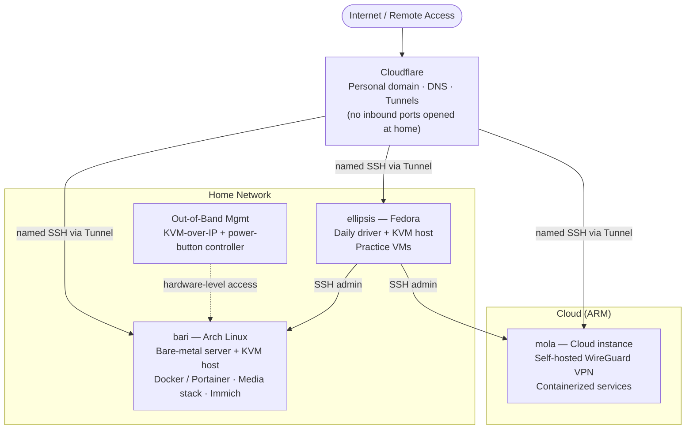

# Home Lab — Self-Hosted Multi-Node Infrastructure

A personal, production-minded home lab spanning local hardware and cloud, built and maintained end to end. It runs containerized services, virtual machines, a self-hosted VPN, and out-of-band hardware management, with all remote access brokered securely through Cloudflare — no inbound ports exposed on the home network.

> Built and administered independently as a hands-on platform for learning Linux system administration, networking, containerization, and secure remote access.

---

## At a Glance

| | |
|---|---|
| **Nodes** | 3 (2 local bare-metal, 1 cloud) |
| **Operating systems** | Fedora, Arch Linux (local); cloud Linux (ARM) |
| **Virtualization** | KVM / QEMU (libvirt) |
| **Containers** | Docker, managed with Portainer |
| **Networking / edge** | Cloudflare — DNS, Tunnels (zero exposed inbound ports) |
| **Remote access** | SSH by hostname; out-of-band KVM-over-IP |
| **VPN** | Self-hosted WireGuard |

---

## Architecture

---

## Nodes

### `ellipsis` — Fedora (daily driver + hypervisor)
- Primary workstation, also serving as a KVM/QEMU hypervisor via libvirt.
- Runs practice virtual machines used for learning and testing (e.g., Linux administration labs).

### `bari` — Arch Linux (bare-metal server)
- Intel quad-core, 12 GB RAM, 2 TB SSD.
- Hosts a suite of self-hosted services in **Docker**, managed through **Portainer**, including a media automation stack and **Immich** (self-hosted photo/video backup).
- Also configured as a **KVM/QEMU hypervisor** for additional virtual machines.
- **Out-of-band management:** a **KVM-over-IP** appliance provides hardware-level access independent of the OS, secured with password and two-factor authentication. A physical power-button controller adds true remote power cycling.

### `mola` — Cloud instance (ARM)
- Always-on cloud compute node.
- Hosts a **self-hosted WireGuard VPN** for secure, encrypted remote access to the environment, rather than relying on a third-party VPN.
- Runs additional containerized services.

---

## Networking & Access

- **Cloudflare edge.** A personal domain is managed in Cloudflare for DNS and security. **Cloudflare Tunnels** publish selected services and broker remote SSH to each host, so administration works from anywhere **without forwarding a single inbound port** on the home network.
- **Named SSH access.** Each host is reachable by hostname over SSH through the tunnel, from any network.
- **Self-hosted VPN.** A WireGuard server (deployed on the cloud node) provides encrypted access into the environment.
- **Out-of-band control.** A KVM-over-IP device plus a physical power-button controller allow recovery and power cycling of the bare-metal server even when the OS is unavailable.

---

## Services

Self-hosted and containerized (Docker / Portainer):

- **Immich** — self-hosted photo and video backup and management
- **Media stack** — automated media library management and streaming
- **WireGuard** (wg-easy) — self-hosted VPN
- **Cloudflare Tunnel** — secure ingress without open ports

---

## Skills Demonstrated

- Linux system administration across multiple distributions (Fedora, Arch)
- Virtualization with KVM / QEMU (libvirt) — provisioning and managing VMs
- Containerization and container management (Docker, Portainer)
- Deploying and maintaining self-hosted applications
- Secure networking with Cloudflare (DNS, Tunnels) and no exposed inbound ports
- Self-hosted VPN configuration (WireGuard)
- Out-of-band / KVM-over-IP hardware management
- Day-to-day remote administration over SSH; command-line proficiency
- Documentation and a security-conscious, least-exposure approach

---

## Roadmap

- Pursue **RHCSA (RHEL 10)** — practicing in local KVM VMs
- Add **Ansible** to automate provisioning and configuration across nodes
- Introduce centralized monitoring (Prometheus / Grafana)
- Add Cloudflare Access (edge authentication) in front of management interfaces
- Automate backups (restic / Borg) with off-site copies

---

*Architecture is described generically by design — no live hostnames, addresses, or secrets are published.*
